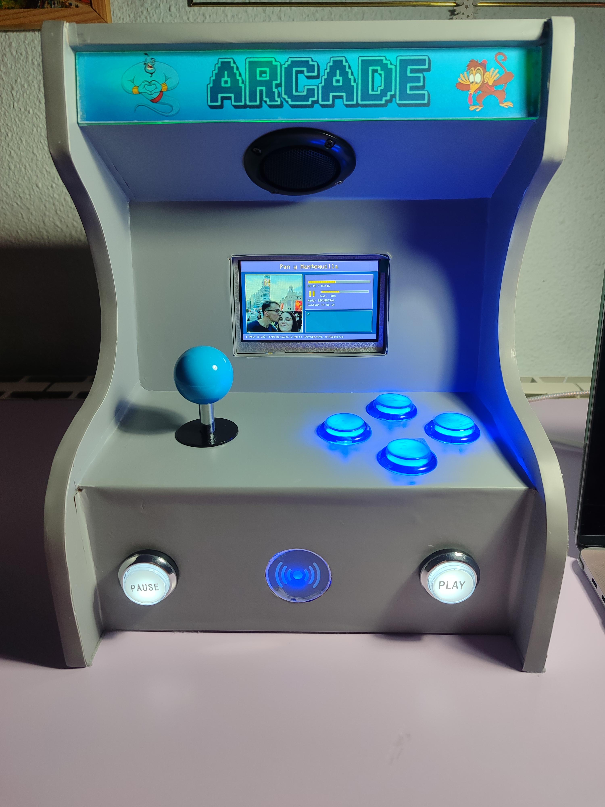
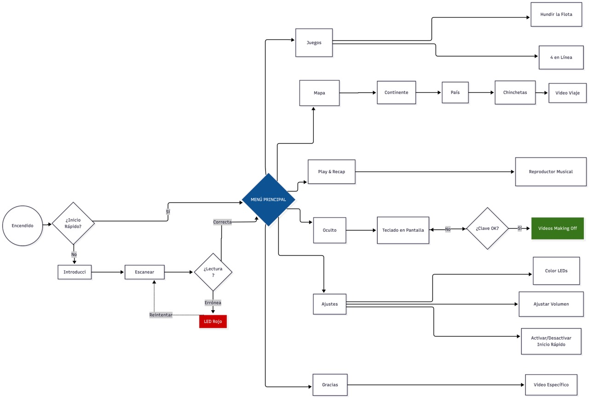

# ARCADE DISNEY ALADDIN 

  
  
  
  

## ⚙️ Arquitectura del Sistema
Arquitectura distribuida de doble microcontrolador implementada para solventar la saturación de I/O (pines) de la unidad principal, delegando el procesamiento de entradas a un nodo secundario sin comprometer la velocidad del bus gráfico.

* **Unidad Principal (ESP32-S3 / JC4827W543):** Responsable de la ejecución del núcleo de la aplicación, el motor gráfico mediante `Arduino GFX` y el renderizado de la interfaz.
* **Subsistema Periférico (ESP32 Wroom 32):** Dedicado exclusivamente al control de botoneras, joystick, lector RFID y tira LED mediante IR.
* **Enlace de Comunicación:** Interconexión síncrona/asíncrona bidireccional mediante bus serie **UART** entre ambos microcontroladores.

---

## 🏆 Resultado y Organización

<table border="0">
  <tr>
    <!-- COLUMNA IZQUIERDA: VISTA GENERAL -->
    <td width="50%" align="center" valign="top">
      <h3> Vista General</h3>
       
      
      
<i>Máquina Arcade Finalizada y Funcionando</i>

    </td>
    <!-- COLUMNA DERECHA: ESTRUCTURA DEL REPOSITORIO -->
    <td width="50%" align="left" valign="top">
      <h3>Estructura del Repositorio</h3>
       
      <!-- Usamos <pre> para forzar el formato de texto preformateado y evitar que se amontone -->
      <pre style="font-family: 'Courier New', Courier, monospace; font-size: 0.9em; background-color: #161b22; padding: 15px; border-radius: 8px; border: 1px solid #30363d;">
 Arcade-Disney-Aladdin
 ┣ 📂 assets/
 ┃ ┣ # Imágenes, banners y esquemas
 ┃ ┣ 📄 banner.png
 ┃ ┗ 📄 maquina_arcade.jpg
 ┃      
 ┣ 📂 docs/   
 ┣ # Documentación técnica y manuales
 ┃ ┣ 📂 datasheets/
 ┃ ┗ 📂 manuales/
 ┃      
 ┣ 📂 fabricación/   
 ┣ # Esquema eléctrico y planos 
 ┃ ┣ 📂 electronics/
 ┃ ┗ 📂 structure/
 ┃      
 ┣ 📂 src/
 ┃ ┣ 📂 esp32_s3_main/
 ┃ ┃ ┣ # Código principal 
 ┃ ┗ 📂 esp32_wroom_per/
 ┃   ┣ # Código secundario 
 ┃ 
 ┣ 📄 .gitignore
 ┣ 📄 LICENSE
 ┗ 📄 README.md
      </pre>
    </td>
  </tr>
</table>

---

## 🔄 Diagrama de flujo (Máquina de Estados)

  <!-- Asegúrate de guardar tu imagen exportada de Draw.io con este nombre en la carpeta assets -->
  

---

## 📚 Documentación
Enlace a documentación del repositorio

*  [Esquema Electrónico y Cableado](fabricación/electronics/Arcade_Schematic.pdf)

---

## 📄 Licencia

Este proyecto está protegido bajo derechos de autor exclusivos. Consulta el archivo [LICENSE](LICENSE) para más información.
